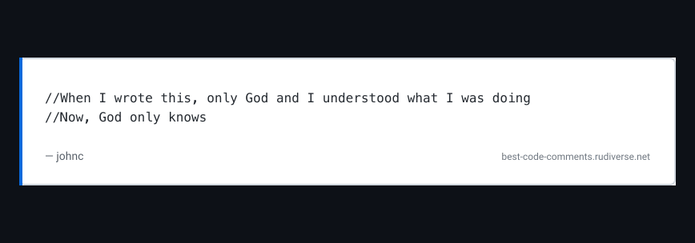

# Best Code Comments API

<div align="center">
  
  <p><em>An API that shares legendary source code comments as embeddable image or JSON.</em></p>

  <a href="https://hono.dev/"></a>
  <a href="https://bun.sh/"></a>
  <a href="https://www.typescriptlang.org/"></a>
  <a href="https://sharp.pixelplumbing.com/"></a>
</div>


## What is this?

This project grew out of revisiting the classic Stack Overflow thread:

- [“What is the best comment in source code you have ever encountered?”](https://stackoverflow.com/questions/184618/what-is-the-best-comment-in-source-code-you-have-ever-encountered)

Those snippets are too good to stay buried in an old discussion, so this service curates and repackages them. Use the API to

- fetch JSON for bots, dashboards, or daily inspiration widgets,
- embed themed SVG/PNG cards in READMEs, slides, and blog posts,
- or simply hit `/api/random` for a laugh whenever you need one.

## Endpoints

| Method | Path                             | Description                          | Query params                             |
|--------|----------------------------------|--------------------------------------|------------------------------------------|
| `GET`  | `/health`                        | Service status and metadata          | —                                        |
| `GET`  | `/api/random`                    | Random comment with optional filters | `tags`, `author`, `maxLines`, `minPopularity` |
| `GET`  | `/api/comment/:id`               | Fetch a comment by numeric ID        | —                                        |
| `GET`  | `/comment.svg`<br>`/comment.png` | Render a comment as SVG or PNG (via Sharp) | `id`, `tags`, `author`, `maxLines`, `minPopularity`, `theme`, `width` |

### Query Parameters

| Name | Default | Description                                                                          |
|------|---------|--------------------------------------------------------------------------------------|
| `tags` | — | Comma-separated tag filter; see [`src/types.ts`](src/types.ts) for supported values. |
| `author` | — | Case-insensitive substring match on the author field.                                |
| `maxLines` | `25` | Maximum number of lines the comment should have.                              |
| `minPopularity` | `2` | Minimum stackoverflow popularity score the comment should have.                      |
| `id` | — | Request a specific comment by numeric ID.                                            |
| `theme` | `light` | Theme for rendered SVG/PNG cards; supports `light` and `dark`.                       |
| `width` | `820` | Width of the rendered SVG in pixels (string or number).                              |

SVG/PNG requests without an `id` redirect to a random comment that fits your filters, including `maxLines` and `minPopularity`.

### Examples

#### JSON (random)

```bash
curl https://localhost:3000/api/random
```

```json
{
  "id": 66,
  "author": "Yuval",
  "date": "2011-07-15 11:57:51Z",
  "source": "https://stackoverflow.com/a/400211",
  "popularity": 105,
  "tags": [
    "humor",
    "meta"
  ],
  "content": "// This comment is self explanatory."
}
```

#### SVG (random)

```bash
curl "https://localhost:3000/comment.svg" -o comment.svg
```


#### SVG (dark theme)

```bash
curl "https://localhost:3000/comment.svg?id=135&theme=dark" -o comment.svg
```


#### PNG (custom width)

```bash
curl "https://localhost:3000/comment.png?id=177&width=1300" -o comment.png
```


## Quick Start

```bash
bun install
bun run build    # preprocess comment data
bun run dev      # runs bun --hot src/index.ts
```

Visit `http://localhost:3000/health` to confirm the service is running. The `/all` route is available in development for
a quick gallery of every comment.


## Project Structure

```
.
├── src/
│   ├── components/
│   │   ├── commentsAllPage.ts    # Dev-only gallery HTML renderer
│   │   └── commentsSvg.ts        # SVG string renderer
│   ├── data/                     # Preprocessed comment dataset (JSON)
│   ├── index.ts                  # Hono application entry point
│   ├── types.ts                  # Shared type definitions
│   └── utils.ts                  # Filtering helpers and constants
├── scripts/                      # Data scraping/build tools
├── fonts/                        # Local fallbacks for Sharp/Vercel
├── html/                         # Scraped HTML snapshots
└── README.md
```

## Rendering Details

- SVGs import _JetBrains Mono_ and _Roboto_ from [Google Fonts](https://fonts.google.com/) (distributed under the SIL Open Font License and Apache 2.0 respectively).
- Text wrapping keeps whitespace intact for ASCII art comments.
- PNGs are rasterised from SVG using Sharp, so fonts must be accessible even in headless environments (handled by inline
  imports and optional fontconfig).

---

<div align="center">
  <p>🙌 Thanks to the Stack Overflow community.</p>
  <p>⭐ <em>If this API made you smile, consider sharing it and starring the repo.</em></p>
</div>
